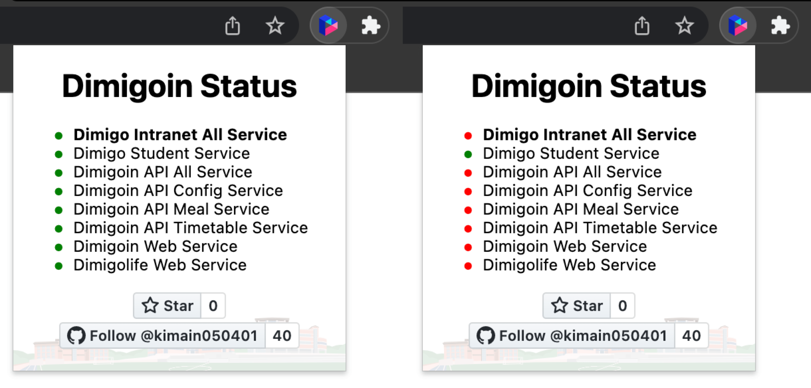

# Dimigoin Status 크롬 확장 프로그램

## 소개
디미고인 및 디미고라이프의 운영 상태를 크롬 확장 프로그램에서 실시간으로 확인할 수 있게 해주는 크롬 확장 프로그램입니다.

## 미리보기

## 설치 방법
[가장 최신 릴리즈](https://github.com/kimain050401/dimigoin-status-chrome/releases/latest)에서 하단의 `dimigoin-status-1.0.0.zip`를 눌러서 다운받은 후 실행하면 자동으로 크롬 확장 프로그램에 추가됩니다.

## 라이센스
Dimigoin Status 크롬 확장 프로그램은 `GNU General Public License v3.0` 라이센스에 따라 사용하실 수 있습니다.  
dimigoin-status-chrome 라이센스에 대한 자세한 사항은 [라이센스 파일](https://github.com/kimain050401/dimigoin-status-chrome/blob/main/LICENSE)을 참고해주세요.

## 추후 추가 예정 사항
- [ ] 디미고인 및 디미고라이프 웹사이트 위에 현재 디미고인 및 디미고라이프의 운영 상태 표시
- [ ] 디미고인 및 디미고라이프의 운영 상태가 변경되면 로컬 알림
